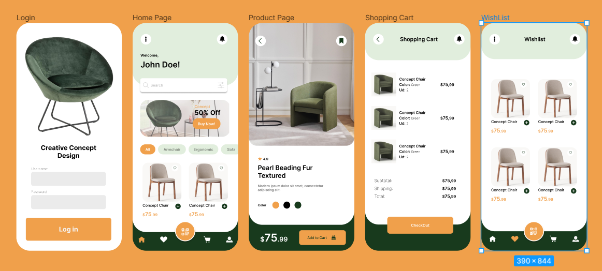

# Welcome to Creative Concept Design

## 💻About the project

This project is an e-commerce platform for a furniture store built using React. It provides customers with an intuitive and visually appealing interface to browse and purchase furniture items online. The application includes features such as product categorization, product details and shopping cart management.



## 📲Features

- 📖Product Catalog: Browse range of furniture products categorized by type.

- 🪑Product Details: View detailed information about each furniture item, including image, rating, colors and pricing.

- 🛒Shopping Cart: Add items to the shopping cart, update quantities, and remove items as needed.

- Wishlist: Add items and remove them as needed.

- User Authentication: Register an account or log in to track orders and manage personal information.

## ⚙️Technologies used
**React**: Front-end JavaScript library for building user interfaces.

**React Router**: Library for handling navigation and routing in React applications.

**react-hot-toast**: A lightweight and customizable toast notification library for React applications.

## 📝Daily records
    -Day 1:
        Figma design: Login and Homepage

    -Day2:
        Figma design: Product Page, Shopping Cart and Wishlist

    -Day3:
        Click up
        Login layout
        Create users.json and products.json

    -Day 4:
        Pages
        Routes

    -Day 5:
        Home layout
        Form validation in Login Page

    -Day 6:
        Private routes

    -Day 7:
        Paint products on home page
        Create useContext for user information
        Function that saves products in the cart
        Function that saves products in the wishlist

    -Day 8:
        Dynamic links for each product page
        Product page layout

    -Day 9:
        Cart Page layout
        Paint products saved in user cart

    -Day 10:
        Show total amount in Shopping Page
        Add category filters in Home Page

    -Day 11:
        Add buttons that edit quantity of products

    -Day 12:
        Add button that removes product from shopping cart

    -Day 13:
        Wishlist Page layout
        Show products saved in whislist

    -Day 15:
        Add button that removes product from wishlist


## ⚠️Struggles

- Difficulty editing or deleting products from the shopping page.

- The difficulty in knowing how to pass information from one component to another.

´- Difficulty in componentizing certain parts of the project

## 🧑‍💻Installation

To run this application locally, follow these steps:

```bash
1. Clone the repository:

git clone  https://github.com/albams5/react-e-commerce.git

2. Navigate to the project directory:

cd react-e-commerce

3. Run it: 

npm run dev
```

## 💻Deployment

This project is already deployed in Vercel: https://react-e-commerce-gules.vercel.app/

